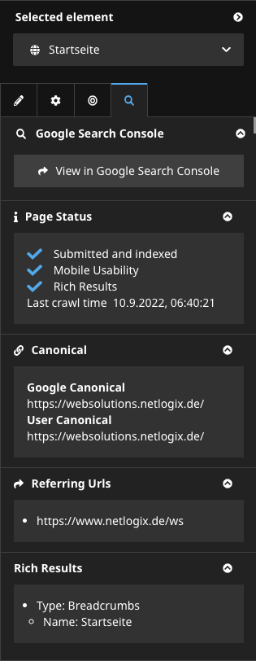

# Netlogix.GoogleSearchConsoleInspector

This package adds an inspector tab for document level nodes, which provides insights into Google Search Console data for the given document, provided by the [Google Search Console URL Inspection API](https://developers.google.com/search/blog/2022/01/url-inspection-api).

### Installation

```shell
composer require netlogix/googlesearchconsoleinspector
```

| Supported Neos Versions |
|-------------------------|
| ^ 7.3                   |
| ^ 8.1                   |

### Configuration
A JSON credentials file for a Google service account is required. See [Create a service account](https://developers.google.com/workspace/guides/create-credentials?hl=en#create_a_service_account) for details.
The path to the credentials file should be set in the environment variable `GOOGLE_APPLICATION_CREDENTIALS`.

Alternatively, the path can be set at the configuration path `Netlogix.GoogleSearchConsoleInspector.api.clientConfig.credentials`.

At `Netlogix.GoogleSearchConsoleInspector.siteUrlMapping` add the mapping of Google Search Console Properties to URL prefixes for your site.
Please refer to [Google's documentation](https://developers.google.com/webmaster-tools/v1/urlInspection.index/inspect) for details.

```yaml
Netlogix:
  GoogleSearchConsoleInspector:
    api:
      # See https://github.com/googleapis/google-api-php-client/blob/main/src/Client.php#L112
      clientConfig:
        'application_name': 'Neos Search Console Inspector'

        # See https://developers.google.com/workspace/guides/create-credentials?hl=en#create_a_service_account
        'credentials': '%env:GOOGLE_APPLICATION_CREDENTIALS%'

    siteUrlMapping:
      'sc-domain:example.org':
        - 'https://www.example.org'
        - 'https://example.org'

      'https://www.example.com':
        - 'https://www.example.com'
```

For document nodetypes you want to inspect, add the `Netlogix.GoogleSearchConsoleInspector:Inspectable` to the supertypes. This will add the inspector tab to the document node.

```yaml
'Neos.Demo:Document':
  superTypes:
    'Netlogix.GoogleSearchConsoleInspector:Inspectable': true
```

### Usage

On document level nodes a new tab will be added in the left-hand inspector window. It provides the following functionality:



The first section offers a button leading directly to Googles own [URL Inspection Tool](https://support.google.com/webmasters/answer/9012289), preconfigured with the current page data.

The second sections provides data about Google's [indexing status](https://support.google.com/webmasters/answer/9012289?hl=en#using_the_tool), [mobile usability](https://developers.google.com/search/mobile-sites/get-started) according to Google, [rich results]((https://developers.google.com/search/docs/appearance/structured-data/intro-structured-data)) availability and the last time the site was crawled.

The third section displays information about the current Google and user [canonicals](https://developers.google.com/search/docs/crawling-indexing/consolidate-duplicate-urls) used.

The fourth section contains a list of Urls for which Google is aware of the current page is being referenced from.

The last section shows information Google has about the [structured data](https://developers.google.com/search/docs/appearance/structured-data/intro-structured-data) the page contains.
